# Design Document: Common Schemas Fix (BUG-011)

## Overview

This design addresses critical issues in the Common Schemas identified through comprehensive audits of the OpenAPI specification, backend implementation, and frontend integration. The system currently has 4 different pagination schemas with inconsistent usage, missing schema definitions, type specification violations, and incomplete frontend implementations.

The fix involves three main areas:
1. **OpenAPI Specification Fixes**: Add missing schemas, fix type violations, standardize formats
2. **Backend Updates**: Add utoipa annotations for PaginationMeta, ensure consistency
3. **Frontend Improvements**: Export missing types, fix type mismatches, implement pagination UI

## Architecture

### System Components

```
┌─────────────────────────────────────────────────────────────┐
│                    OpenAPI Specification                     │
│              contracts/openapi-split/*.yaml                  │
│                                                              │
│  ┌────────────────────────────────────────────────────┐    │
│  │  11-common-schemas.yaml                            │    │
│  │  - ApiError (fix details type)                     │    │
│  │  - PaginationResponse (standardize formats)        │    │
│  │  - PaginationInfo (cursor-based)                   │    │
│  │  - PageMeta (1-indexed, int32/int64 mix)          │    │
│  │  - PaginationMeta (NEW - 0-indexed, int64)        │    │
│  └────────────────────────────────────────────────────┘    │
└─────────────────────────────────────────────────────────────┘
                            │
                            │ generates
                            ▼
┌─────────────────────────────────────────────────────────────┐
│                    Backend (Rust)                            │
│                                                              │
│  ┌────────────────────────────────────────────────────┐    │
│  │  shared/src/types/pagination.rs                    │    │
│  │  - PageRequest (utoipa::ToSchema)                  │    │
│  │  - PageResponse<T> (utoipa::ToSchema)              │    │
│  │  - PageMeta (utoipa::ToSchema)                     │    │
│  └────────────────────────────────────────────────────┘    │
│                                                              │
│  ┌────────────────────────────────────────────────────┐    │
│  │  api/src/routes/transactions.rs                    │    │
│  │  - PaginationMeta (ADD utoipa::ToSchema)           │    │
│  │  - PaginatedTransactionsResponse                   │    │
│  └────────────────────────────────────────────────────┘    │
│                                                              │
│  ┌────────────────────────────────────────────────────┐    │
│  │  api/src/routes/reports.rs                         │    │
│  │  - PaginationResponse (utoipa::ToSchema)           │    │
│  │  - AccountLedgerResponse                           │    │
│  └────────────────────────────────────────────────────┘    │
└─────────────────────────────────────────────────────────────┘
                            │
                            │ API calls
                            ▼
┌─────────────────────────────────────────────────────────────┐
│                    Frontend (TypeScript)                     │
│                                                              │
│  ┌────────────────────────────────────────────────────┐    │
│  │  types/api.generated.ts                            │    │
│  │  (auto-generated from OpenAPI spec)                │    │
│  └────────────────────────────────────────────────────┘    │
│                            │                                 │
│                            │ exports                         │
│                            ▼                                 │
│  ┌────────────────────────────────────────────────────┐    │
│  │  types/api-helpers.ts                              │    │
│  │  - ADD: PageMeta export                            │    │
│  │  - ADD: PageRequest export                         │    │
│  │  - ADD: PageResponse_ExchangeRateListItem export   │    │
│  │  - EXISTING: PaginationMeta export                 │    │
│  └────────────────────────────────────────────────────┘    │
│                            │                                 │
│                            │ used by                         │
│                            ▼                                 │
│  ┌────────────────────────────────────────────────────┐    │
│  │  lib/queries/dashboard.ts                          │    │
│  │  - FIX: Use RecentActivityResponse type            │    │
│  └────────────────────────────────────────────────────┘    │
│                                                              │
│  ┌────────────────────────────────────────────────────┐    │
│  │  app/dashboard/master-data/exchange-rates/page.tsx │    │
│  │  - ADD: Pagination UI controls                     │    │
│  │  - ADD: Page state management                      │    │
│  └────────────────────────────────────────────────────┘    │
└─────────────────────────────────────────────────────────────┘
```

### Pagination Schema Decision Matrix

| Schema | Indexing | Fields | Use Case | Endpoints |
|--------|----------|--------|----------|-----------|
| **PageMeta** | 1-indexed | page (int32), per_page (int32), total (int64), total_pages (int32) | Standard REST pagination | /exchange-rates |
| **PaginationResponse** | 0-indexed | page (int64), limit (int64), total (int64), total_pages (int64) | Reports with large datasets | /reports/accounts/{id}/ledger |
| **PaginationMeta** | 0-indexed | page (int64), limit (int64), total (int64) | Simple pagination without total_pages | /transactions |
| **PaginationInfo** | N/A | limit (int64), has_more (bool), next_cursor (string?) | Cursor-based real-time feeds | /dashboard/activity |

## Components and Interfaces

### OpenAPI Schema Updates

#### 1. ApiError Schema Fix

**Current (Incorrect)**:
```yaml
ApiError:
  properties:
    details:
      description: Additional error details.
      # ❌ NO TYPE SPECIFIED
```

**Fixed**:
```yaml
ApiError:
  properties:
    details:
      description: Additional error details (e.g., validation errors, retry information).
      type: object
      additionalProperties: true
      example:
        retry_after: 60
        field: "email"
        reason: "invalid format"
```

#### 2. PaginationMeta Schema Addition

**New Schema** (to be added to `11-common-schemas.yaml`):
```yaml
PaginationMeta:
  description: Simple pagination metadata for transactions (0-indexed pages, no total_pages calculation).
  properties:
    page:
      description: Current page number (0-indexed).
      type: integer
      format: int64
      minimum: 0
      example: 0
    limit:
      description: Items per page.
      type: integer
      format: int64
      minimum: 1
      example: 50
    total:
      description: Total number of items across all pages.
      type: integer
      format: int64
      minimum: 0
      example: 150
  required:
    - page
    - limit
    - total
  type: object
```

#### 3. Enhanced Schema Descriptions

Update existing schemas with clearer descriptions:

```yaml
PageMeta:
  description: Standard REST pagination metadata (1-indexed pages). Use for traditional offset-based pagination with page numbers starting at 1.
  # ... existing fields

PaginationResponse:
  description: Pagination metadata for reports (0-indexed pages with total_pages). Use for large datasets requiring total page count.
  # ... existing fields

PaginationInfo:
  description: Cursor-based pagination metadata. Use for real-time feeds and infinite scroll where total count is not needed.
  # ... existing fields
```

### Backend Implementation

#### 1. Add utoipa Annotations to PaginationMeta

**File**: `backend/crates/api/src/routes/transactions.rs`

**Current**:
```rust
/// Pagination metadata.
#[derive(Debug, Serialize, utoipa::ToSchema)]
pub struct PaginationMeta {
    /// Current page number (0-indexed).
    pub page: u64,
    /// Items per page.
    pub limit: u64,
    /// Total number of items.
    pub total: u64,
}
```

**Enhanced** (add examples and descriptions):
```rust
/// Pagination metadata for transactions.
#[derive(Debug, Serialize, utoipa::ToSchema)]
#[schema(description = "Simple pagination metadata for transactions (0-indexed pages, no total_pages calculation).")]
pub struct PaginationMeta {
    /// Current page number (0-indexed).
    #[schema(example = 0, description = "Current page number (0-indexed).")]
    pub page: u64,
    
    /// Items per page.
    #[schema(example = 50, description = "Items per page.")]
    pub limit: u64,
    
    /// Total number of items.
    #[schema(example = 150, description = "Total number of items across all pages.")]
    pub total: u64,
}
```

#### 2. Verify Existing Implementations

No changes needed to:
- `PageMeta` in `shared/src/types/pagination.rs` (already correct)
- `PaginationResponse` in `api/src/routes/reports.rs` (already correct)
- `PaginationInfo` in `api/src/routes/dashboard.rs` (already correct)

### Frontend Implementation

#### 1. Type Exports in api-helpers.ts

**File**: `frontend/src/types/api-helpers.ts`

**Add to Pagination section** (around line 176):
```typescript
// Pagination
export type PaginationResponse = Schema<'PaginationResponse'>
export type PaginationInfo = Schema<'PaginationInfo'>
export type PaginationMeta = Schema<'PaginationMeta'>  // Already exists
export type PageMeta = Schema<'PageMeta'>  // ADD THIS
export type PageRequest = Schema<'PageRequest'>  // ADD THIS
export type PageResponse_ExchangeRateListItem = Schema<'PageResponse_ExchangeRateListItem'>  // ADD THIS
```

#### 2. Fix Dashboard Activity Type Mismatch

**File**: `frontend/src/lib/queries/dashboard.ts`

**Current (Incorrect)**:
```typescript
interface ActivityResponse {
    activities: {
        id: string
        // ... fields
    }[]
    // ❌ Missing pagination field!
}

export function useRecentActivity() {
    return useQuery({
        queryKey: ['dashboard', 'recent-activity'],
        queryFn: () => apiClient<ActivityResponse>('/dashboard/recent-activity'),
    })
}
```

**Fixed**:
```typescript
import type { RecentActivityResponse } from '@/types/api-helpers'

// Remove custom ActivityResponse interface

export function useRecentActivity() {
    return useQuery({
        queryKey: ['dashboard', 'recent-activity'],
        queryFn: () => apiClient<RecentActivityResponse>('/dashboard/recent-activity'),
        refetchInterval: 30000 // Real-time feed, refresh every 30s
    })
}
```

#### 3. Exchange Rates Pagination UI

**File**: `frontend/src/app/dashboard/master-data/exchange-rates/page.tsx`

**Add State Management**:
```typescript
export default function ExchangeRatesPage() {
  const [page, setPage] = React.useState(1)  // 1-indexed for PageMeta
  const [perPage] = React.useState(20)
  
  const { data, isLoading } = useExchangeRates({ page, per_page: perPage })
  // ... rest of component
```

**Add Pagination Controls** (after table):
```typescript
{data?.meta && data.meta.total_pages > 1 && (
  <div className="flex items-center justify-between mt-4 px-2">
    <div className="text-sm text-muted-foreground">
      Page {data.meta.page} of {data.meta.total_pages}
      <span className="ml-2">
        ({data.meta.total} total rates)
      </span>
    </div>
    <div className="flex gap-2">
      <Button
        variant="outline"
        size="sm"
        onClick={() => setPage(page - 1)}
        disabled={page === 1}
      >
        Previous
      </Button>
      <Button
        variant="outline"
        size="sm"
        onClick={() => setPage(page + 1)}
        disabled={page >= data.meta.total_pages}
      >
        Next
      </Button>
    </div>
  </div>
)}
```

**Update Query Hook** (in `frontend/src/lib/queries/exchange-rates.ts`):
```typescript
export function useExchangeRates(params?: { page?: number; per_page?: number }) {
  const { page = 1, per_page = 20 } = params || {}
  
  return useQuery({
    queryKey: ['exchange-rates', 'list', page, per_page],
    queryFn: () => apiClient<PageResponse_ExchangeRateListItem>(
      `/exchange-rates/list?page=${page}&per_page=${per_page}`
    ),
  })
}
```

## Data Models

### Pagination Schema Comparison

```typescript
// PageMeta (1-indexed, mixed formats)
interface PageMeta {
  page: number        // int32, 1-indexed
  per_page: number    // int32
  total: number       // int64
  total_pages: number // int32
}

// PaginationResponse (0-indexed, all int64)
interface PaginationResponse {
  page: number        // int64, 0-indexed
  limit: number       // int64
  total: number       // int64
  total_pages: number // int64
}

// PaginationMeta (0-indexed, all int64, no total_pages)
interface PaginationMeta {
  page: number        // int64, 0-indexed
  limit: number       // int64
  total: number       // int64
}

// PaginationInfo (cursor-based)
interface PaginationInfo {
  limit: number           // int64
  has_more: boolean
  next_cursor: string | null
}
```

### ApiError Structure

```typescript
interface ApiError {
  error: string                    // Error code (required)
  message: string                  // Human-readable message (required)
  details?: Record<string, any>    // Additional error details (optional)
  request_id?: string | null       // Request ID for tracing (optional)
}

// Example error responses:
// Rate limiting:
{
  "error": "rate_limited",
  "message": "Too many requests",
  "details": {
    "retry_after": 60
  },
  "request_id": "req_123"
}

// Validation error:
{
  "error": "validation_error",
  "message": "Invalid input",
  "details": {
    "field": "email",
    "reason": "invalid format"
  },
  "request_id": "req_456"
}
```

## Correctness Properties

*A property is a characteristic or behavior that should hold true across all valid executions of a system—essentially, a formal statement about what the system should do. Properties serve as the bridge between human-readable specifications and machine-verifiable correctness guarantees.*


### Property 1: OpenAPI Schema Validation
*For any* API endpoint response or request, the data structure SHALL match the corresponding OpenAPI schema definition including all required fields, types, and format specifiers.

**Validates: Requirements 1.3, 10.1, 10.2, 10.3, 10.4**

**Rationale**: This property ensures that the OpenAPI specification accurately describes the API contract. By validating all requests and responses against the spec, we catch schema drift early and ensure that generated client code works correctly.

**Testing Approach**: Use OpenAPI validation libraries to validate actual API responses against the schema definitions. Test with various endpoints including paginated responses, error responses, and different pagination schemas.

---

### Property 2: Pagination Format Consistency
*For any* pagination schema in the OpenAPI specification, numeric fields representing the same concept (page numbers, limits, totals) SHALL use consistent format specifiers (int32 or int64) based on expected value ranges.

**Validates: Requirements 3.1**

**Rationale**: Consistent type formats make the API predictable and prevent confusion. Fields that can exceed 2^31 should use int64, while smaller bounded values can use int32.

**Testing Approach**: Parse all pagination schemas and verify that:
- Fields representing total counts use int64 (can be large)
- Fields representing page numbers use consistent formats within each schema
- Fields representing limits use consistent formats

---

### Property 3: Schema Documentation Completeness
*For any* schema field in the OpenAPI specification, the field SHALL have a non-empty description that explains its purpose, and pagination fields SHALL document their indexing convention (0-indexed or 1-indexed).

**Validates: Requirements 3.2, 4.1, 8.1, 8.3**

**Rationale**: Complete documentation prevents misunderstandings about API behavior, especially for pagination where indexing conventions vary.

**Testing Approach**: Parse all schema definitions and verify:
- Every field has a non-empty description
- Page number fields explicitly state 0-indexed or 1-indexed
- Schema-level descriptions explain the use case

---

### Property 4: Example Value Presence
*For any* field in a pagination schema, the OpenAPI specification SHALL include an example value that demonstrates the expected format and range.

**Validates: Requirements 8.2**

**Rationale**: Examples help developers understand the API quickly and serve as additional documentation. They also help API documentation tools generate better interactive docs.

**Testing Approach**: Parse all pagination schema fields and verify each has an example attribute with a valid value.

---

### Property 5: Generated Type Usage
*For any* API query hook in the frontend, the response type SHALL be imported from generated types (api.generated.ts or api-helpers.ts) rather than defined as a custom interface, unless the custom interface extends a generated type.

**Validates: Requirements 6.3, 6.4**

**Rationale**: Using generated types ensures type safety and catches API changes at compile time. Custom interfaces can drift from the actual API contract.

**Testing Approach**: Parse all query hook files and verify:
- Response types are imported from api-helpers or api.generated
- If custom interfaces exist, they extend generated types using TypeScript's extends keyword
- No duplicate type definitions exist

---

### Property 6: Backward Compatibility
*For any* existing API endpoint, updating the OpenAPI schema SHALL NOT change the actual response structure, field names, or field types returned by the backend.

**Validates: Requirements 9.1, 9.2, 9.3**

**Rationale**: Backward compatibility ensures existing clients continue to work after schema updates. Documentation changes should not break existing integrations.

**Testing Approach**: 
- Capture baseline API responses before changes
- Apply schema updates
- Verify responses match baseline structure
- Test with boundary values to ensure no overflow issues

## Error Handling

### OpenAPI Validation Errors

**Error**: OpenAPI spec fails validation
- **Cause**: Missing required fields, invalid type formats, or schema references
- **Handling**: Run OpenAPI validator in CI/CD pipeline, fail build if validation errors exist
- **Prevention**: Use utoipa annotations correctly, validate locally before committing

### Type Generation Errors

**Error**: Frontend types don't match backend responses
- **Cause**: OpenAPI spec out of sync with backend implementation
- **Handling**: Regenerate types from latest OpenAPI spec, fix type mismatches
- **Prevention**: Automate type generation in build process, add schema validation tests

### Pagination UI Errors

**Error**: Pagination controls show incorrect page numbers
- **Cause**: Mixing 0-indexed and 1-indexed pagination
- **Handling**: Check schema documentation for indexing convention, adjust UI logic
- **Prevention**: Document indexing clearly in schema descriptions, use consistent patterns

### Missing Schema Errors

**Error**: Generated types missing expected schemas
- **Cause**: Schema not defined in OpenAPI spec or missing utoipa annotations
- **Handling**: Add schema definition to OpenAPI spec, add utoipa::ToSchema annotation
- **Prevention**: Review OpenAPI spec completeness, ensure all response types have schemas

## Testing Strategy

### Dual Testing Approach

This feature requires both unit tests and property-based tests:

**Unit Tests** focus on:
- Specific schema definitions (ApiError.details type, PaginationMeta fields)
- Specific type exports (PageMeta, PageRequest in api-helpers.ts)
- Specific UI interactions (pagination button clicks, page state updates)
- Edge cases (first page, last page, empty results)

**Property Tests** focus on:
- Schema validation across all endpoints
- Format consistency across all pagination schemas
- Documentation completeness across all schemas
- Type usage patterns across all query hooks

### Test Configuration

**Property-Based Tests**:
- Minimum 100 iterations per property test
- Use fast-check (TypeScript) or proptest (Rust) for property testing
- Tag format: `Feature: common-schemas-fix, Property {number}: {property_text}`

**Unit Tests**:
- Test specific examples from requirements
- Test edge cases and error conditions
- Test UI component behavior with Playwright

### Test Organization

```
backend/
  crates/api/src/routes/
    transactions_test.rs
      - test_pagination_meta_schema_generation()
      - test_paginated_transactions_response_structure()
    
  crates/shared/src/types/
    pagination_test.rs
      - test_page_meta_schema_annotations()
      - test_page_request_defaults()

frontend/
  src/types/
    api-helpers.test.ts
      - test_pagination_types_exported()
      - test_page_meta_export()
      - test_page_request_export()
  
  src/lib/queries/
    dashboard.test.ts
      - test_recent_activity_uses_generated_type()
  
  src/app/dashboard/master-data/exchange-rates/
    page.test.tsx
      - test_pagination_controls_rendered()
      - test_previous_button_disabled_on_first_page()
      - test_next_button_disabled_on_last_page()
      - test_page_parameter_passed_to_api()

contracts/
  openapi-split/
    validation.test.ts
      - test_openapi_spec_valid()
      - test_api_error_details_type_defined()
      - test_pagination_meta_schema_exists()
      - test_all_schemas_have_descriptions()
      - test_all_fields_have_examples()

e2e/
  tests/
    pagination.spec.ts
      - test_exchange_rates_pagination_works()
      - test_transactions_pagination_works()
      - test_ledger_pagination_works()
      - test_activity_cursor_pagination_works()
```

### Property Test Examples

**Property 1: Schema Validation**
```typescript
// Feature: common-schemas-fix, Property 1: OpenAPI Schema Validation
test('all paginated responses match OpenAPI schemas', async () => {
  await fc.assert(
    fc.asyncProperty(
      fc.record({
        endpoint: fc.constantFrom(
          '/transactions',
          '/exchange-rates/list',
          '/reports/accounts/{id}/ledger',
          '/dashboard/recent-activity'
        ),
        page: fc.nat(100),
        limit: fc.integer({ min: 1, max: 100 })
      }),
      async ({ endpoint, page, limit }) => {
        const response = await apiClient(
          `${endpoint}?page=${page}&limit=${limit}`
        )
        const schema = getSchemaForEndpoint(endpoint)
        const validation = validateAgainstSchema(response, schema)
        expect(validation.valid).toBe(true)
      }
    ),
    { numRuns: 100 }
  )
})
```

**Property 2: Format Consistency**
```typescript
// Feature: common-schemas-fix, Property 2: Pagination Format Consistency
test('pagination schemas use consistent formats for similar fields', () => {
  fc.assert(
    fc.property(
      fc.constantFrom(
        'PageMeta',
        'PaginationResponse',
        'PaginationMeta',
        'PaginationInfo'
      ),
      (schemaName) => {
        const schema = openApiSpec.components.schemas[schemaName]
        const totalField = schema.properties.total
        const limitField = schema.properties.limit || schema.properties.per_page
        
        // Total counts should use int64
        if (totalField) {
          expect(totalField.format).toBe('int64')
        }
        
        // Limits should be consistent within schema
        if (limitField) {
          expect(['int32', 'int64']).toContain(limitField.format)
        }
      }
    ),
    { numRuns: 100 }
  )
})
```

**Property 3: Documentation Completeness**
```typescript
// Feature: common-schemas-fix, Property 3: Schema Documentation Completeness
test('all pagination schema fields have descriptions', () => {
  fc.assert(
    fc.property(
      fc.constantFrom(
        'PageMeta',
        'PaginationResponse',
        'PaginationMeta',
        'PaginationInfo'
      ),
      (schemaName) => {
        const schema = openApiSpec.components.schemas[schemaName]
        
        // Schema itself should have description
        expect(schema.description).toBeTruthy()
        expect(schema.description.length).toBeGreaterThan(10)
        
        // All fields should have descriptions
        Object.entries(schema.properties).forEach(([fieldName, field]) => {
          expect(field.description).toBeTruthy()
          expect(field.description.length).toBeGreaterThan(5)
          
          // Page fields should document indexing
          if (fieldName === 'page') {
            const desc = field.description.toLowerCase()
            expect(
              desc.includes('0-indexed') || desc.includes('1-indexed')
            ).toBe(true)
          }
        })
      }
    ),
    { numRuns: 100 }
  )
})
```

**Property 5: Generated Type Usage**
```typescript
// Feature: common-schemas-fix, Property 5: Generated Type Usage
test('query hooks use generated types not custom interfaces', () => {
  fc.assert(
    fc.property(
      fc.constantFrom(
        'dashboard.ts',
        'transactions.ts',
        'exchange-rates.ts',
        'reports.ts'
      ),
      (fileName) => {
        const fileContent = fs.readFileSync(
          `src/lib/queries/${fileName}`,
          'utf-8'
        )
        
        // Should import from api-helpers or api.generated
        const hasGeneratedImports = 
          fileContent.includes("from '@/types/api-helpers'") ||
          fileContent.includes("from '@/types/api.generated'")
        
        // Should not define custom response interfaces
        const hasCustomInterfaces = 
          /interface \w+Response/.test(fileContent) &&
          !fileContent.includes('extends')
        
        expect(hasGeneratedImports).toBe(true)
        expect(hasCustomInterfaces).toBe(false)
      }
    ),
    { numRuns: 100 }
  )
})
```

### Integration Testing

**End-to-End Tests** (using Playwright MCP):
1. Test exchange rates pagination UI
2. Test transactions pagination
3. Test account ledger pagination
4. Test dashboard activity cursor pagination
5. Verify all pagination controls work correctly
6. Verify page parameters are passed to API
7. Verify responses are parsed correctly

**Test Credentials**: corp@zeltra.io / qwertyui

### Validation Testing

**OpenAPI Spec Validation**:
- Run `openapi-generator validate` on spec files
- Verify no errors or warnings
- Check all $ref references resolve correctly

**Type Generation Validation**:
- Generate TypeScript types from OpenAPI spec
- Verify all pagination types are generated
- Verify no TypeScript compilation errors
- Verify types match backend responses

## Implementation Notes

### Backward Compatibility Considerations

1. **No Breaking Changes**: All changes are additive or documentation-only
   - Adding PaginationMeta schema doesn't change existing endpoints
   - Fixing ApiError.details type is clarification, not change
   - Frontend changes are internal refactoring

2. **Existing Endpoints Unchanged**:
   - `/transactions` continues returning same structure
   - `/exchange-rates/list` continues returning same structure
   - `/reports/accounts/{id}/ledger` continues returning same structure
   - `/dashboard/recent-activity` continues returning same structure

3. **Type Safety Improvements**:
   - Frontend gets better type checking
   - No runtime behavior changes
   - Existing API clients continue working

### Migration Path

1. **Phase 1: OpenAPI Spec Updates**
   - Add PaginationMeta schema
   - Fix ApiError.details type
   - Enhance descriptions
   - Validate spec

2. **Phase 2: Backend Updates**
   - Add utoipa annotations to PaginationMeta
   - Regenerate OpenAPI spec
   - Verify no response structure changes

3. **Phase 3: Frontend Updates**
   - Regenerate types from updated spec
   - Add missing type exports
   - Fix dashboard activity type
   - Implement exchange rates pagination UI

4. **Phase 4: Testing**
   - Run unit tests
   - Run property tests
   - Run E2E tests
   - Validate backward compatibility

### Code Generation Workflow

```mermaid
graph LR
    A[Rust Code with utoipa] --> B[Generate OpenAPI Spec]
    B --> C[Fix Nullable Syntax]
    C --> D[Split into YAML files]
    D --> E[Validate OpenAPI Spec]
    E --> F[Generate TypeScript Types]
    F --> G[Frontend Uses Types]
    
    style A fill:#f9f,stroke:#333
    style C fill:#fbb,stroke:#333
    style F fill:#bbf,stroke:#333
    style E fill:#bfb,stroke:#333
```



**Note on utoipa Nullable Bug**: utoipa generates OpenAPI 3.1 syntax `type: [T, 'null']` which is incompatible with OpenAPI 3.0 tooling. The `split-openapi.py` script automatically converts this to `type: T` + `nullable: true` during the split process. This is already handled for existing schemas and will work for the new PaginationMeta schema.

### Documentation Updates

After implementation, update:
1. API documentation with pagination patterns
2. Developer guide with type usage examples
3. OpenAPI spec comments with clear descriptions
4. README with pagination schema decision matrix
