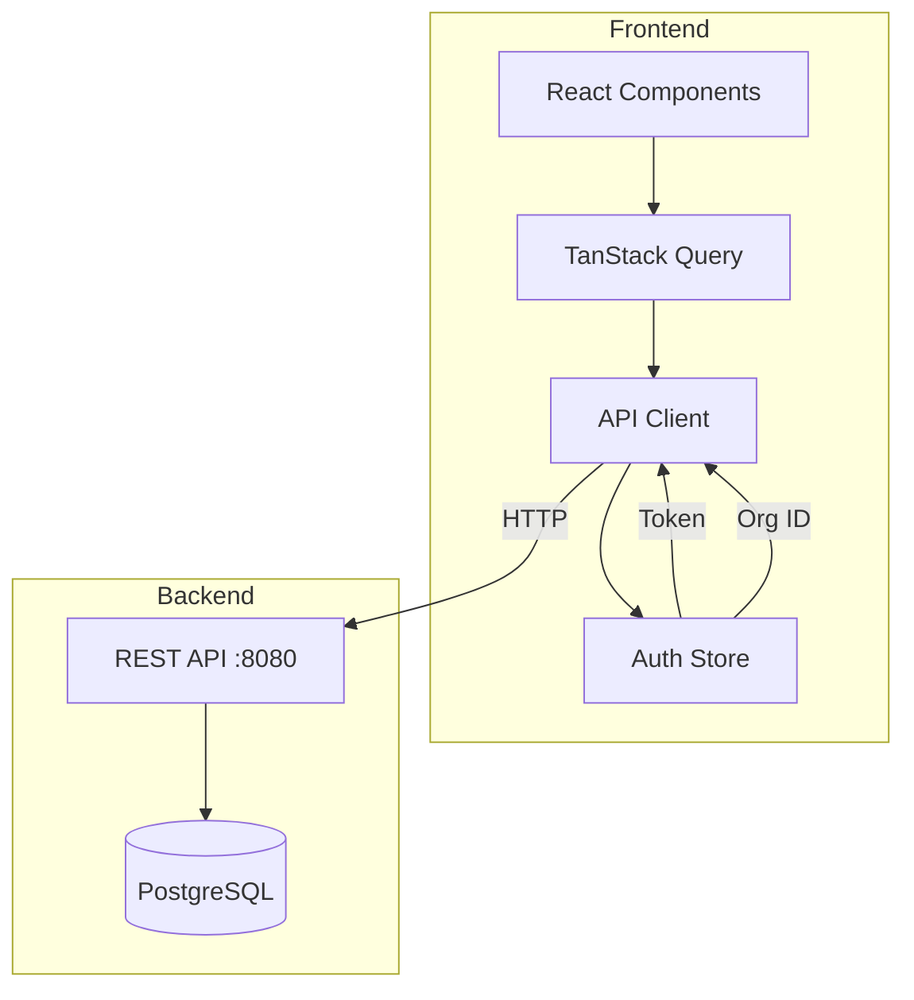
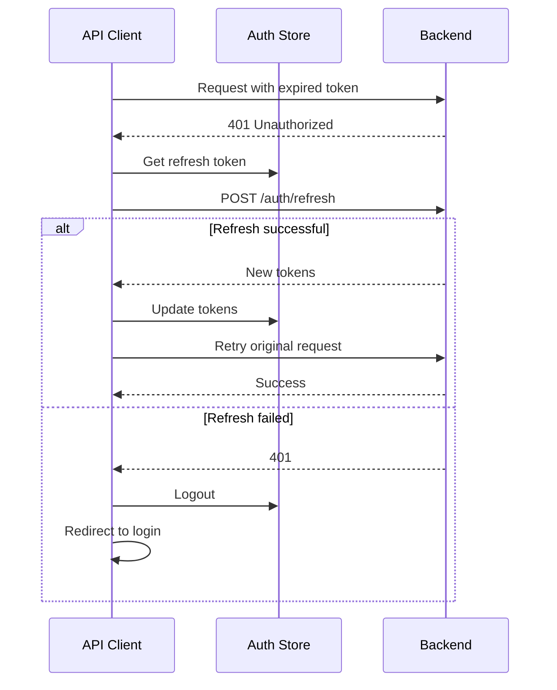

# Design Document: Real API Integration

## Overview

This design document describes the integration of the Zeltra frontend with the real backend API, replacing all mock data dependencies. The integration covers authentication, organization management, role-based access control, and API client optimization.

## Architecture



## Components and Interfaces

### 1. API Client (`frontend/src/lib/api/client.ts`)

The API client is the central HTTP communication layer.

```typescript
interface ApiClientConfig {
  baseUrl: string
  timeout: number // default 30000ms
}

async function apiClient<T>(
  endpoint: string,
  options?: RequestInit & { skipAuth?: boolean }
): Promise<T>
```

Key behaviors:
- Always sends requests to real backend (no mock fallback)
- Includes `Authorization: Bearer {token}` for authenticated requests
- Includes `X-Organization-ID: {orgId}` for organization-scoped requests
- Handles 401 with automatic token refresh
- Handles 403 with permission denied error
- Configurable timeout (default 30 seconds)

### 2. Auth Store (`frontend/src/lib/stores/authStore.ts`)

Zustand store for authentication state.

```typescript
interface AuthState {
  user: User | null
  accessToken: string | null
  refreshToken: string | null
  currentOrgId: string | null
  tokenExpiresAt: number | null
  
  setAuth: (user: User, accessToken: string, refreshToken: string, expiresIn: number) => void
  setOrg: (orgId: string) => void
  logout: () => void
  isTokenExpired: () => boolean
  refreshAccessToken: () => Promise<boolean>
}
```

### 3. Organization Types (`frontend/src/types/organizations.ts`)

```typescript
type UserRole = 'owner' | 'admin' | 'approver' | 'accountant' | 'viewer' | 'submitter'

interface OrganizationUser {
  id: string
  full_name: string
  email: string
  role: UserRole
  status: 'active' | 'invited' | 'disabled'
  joined_at: string | null
  approval_limit?: string
}

interface CreateOrganizationRequest {
  name: string
  slug: string
  base_currency: string
  timezone: string
}
```

### 4. Create Organization Dialog Component

```typescript
interface CreateOrganizationDialogProps {
  open: boolean
  onOpenChange: (open: boolean) => void
  onSuccess?: (org: Organization) => void
}
```

Form fields:
- `name`: Organization display name (required)
- `slug`: URL-friendly identifier (required, validated)
- `base_currency`: ISO 4217 currency code (required)
- `timezone`: IANA timezone (required)

## Data Models

### API Response Formats

```typescript
// Success response
interface ApiResponse<T> {
  data: T
}

// Error response
interface ApiError {
  error: {
    code: string
    message: string
    details?: Record<string, string[]>
  }
}

// Paginated response
interface PaginatedResponse<T> {
  data: T[]
  pagination: {
    page: number
    limit: number
    total: number
  }
}
```

### Authentication Response

```typescript
interface LoginResponse {
  user: {
    id: string
    email: string
    full_name: string
    organizations: Array<{
      id: string
      name: string
      slug: string
      role: UserRole
    }>
  }
  access_token: string
  refresh_token: string
  expires_in: number
}
```

## Correctness Properties

*A property is a characteristic or behavior that should hold true across all valid executions of a system-essentially, a formal statement about what the system should do. Properties serve as the bridge between human-readable specifications and machine-verifiable correctness guarantees.*

### Property 1: No Mock Fallback

*For any* API request made by the API_Client, the request SHALL be sent directly to the backend and any errors SHALL be propagated without attempting mock data fallback.

**Validates: Requirements 1.2, 1.5**

### Property 2: Authentication Headers

*For any* authenticated API request, the API_Client SHALL include the `Authorization: Bearer {token}` header when an access token is available in the auth store.

**Validates: Requirements 5.1**

### Property 3: Organization Context Headers

*For any* organization-scoped API request, the API_Client SHALL include the `X-Organization-ID: {orgId}` header when a current organization is selected.

**Validates: Requirements 5.2**

### Property 4: Slug Validation

*For any* string input to the organization slug field, the validation SHALL accept only strings containing lowercase letters (a-z), numbers (0-9), and hyphens (-), and SHALL reject all other characters.

**Validates: Requirements 3.6**

## Error Handling

### HTTP Status Code Handling

| Status | Behavior |
|--------|----------|
| 200-299 | Parse JSON response and return data |
| 401 | Attempt token refresh, retry request, or redirect to login |
| 403 | Throw permission denied error with message |
| 404 | Throw not found error |
| 422 | Parse validation errors and display field-level messages |
| 500+ | Throw server error with user-friendly message |

### Network Error Handling

```typescript
try {
  const response = await fetch(url, options)
  // ...
} catch (error) {
  if (error.name === 'AbortError') {
    throw new Error('Request timed out. Please try again.')
  }
  if (!navigator.onLine) {
    throw new Error('No internet connection. Please check your network.')
  }
  throw new Error('Unable to connect to server. Please try again later.')
}
```

### Token Refresh Flow



## Testing Strategy

### Unit Tests

Unit tests verify specific examples and edge cases:

1. API Client tests:
   - Correct headers are set
   - Error responses are parsed correctly
   - Timeout behavior works as expected

2. Auth Store tests:
   - Token storage and retrieval
   - Token expiration detection
   - Logout clears all state

3. Validation tests:
   - Slug validation accepts valid inputs
   - Slug validation rejects invalid inputs

### Property-Based Tests

Property-based tests verify universal properties across all inputs using a PBT library (e.g., fast-check for TypeScript).

Configuration:
- Minimum 100 iterations per property test
- Tag format: **Feature: real-api-integration, Property {number}: {property_text}**

Properties to test:
1. No Mock Fallback - verify all API calls go to real backend
2. Authentication Headers - verify Bearer token presence
3. Organization Context Headers - verify X-Organization-ID presence
4. Slug Validation - verify regex pattern matching

### E2E Tests

Existing Playwright tests to update:
- `auth.spec.ts` - Update for real API authentication
- `smoke.spec.ts` - Verify pages load with real data
- `transactions.spec.ts` - Test with real transaction API
- `approvals.spec.ts` - Test approval workflow with real permissions

New E2E scenarios:
- Organization creation flow
- Role management with all 6 roles
- Multi-tenancy isolation
