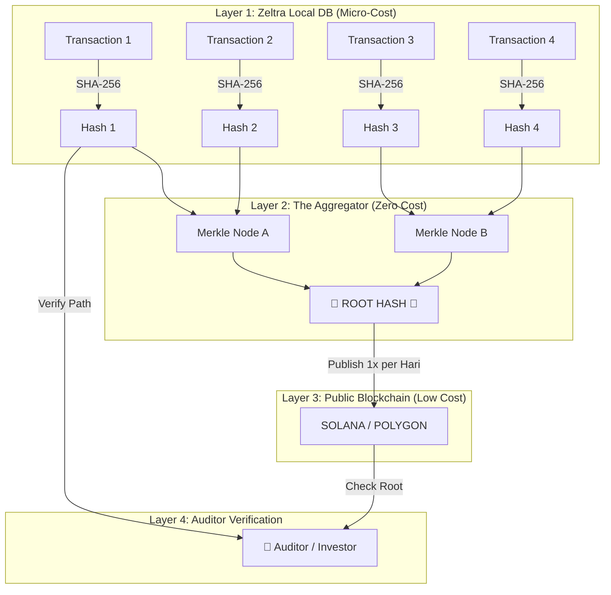

# Zeltra 2026: The "Killer Features" Research

Berdasarkan riset jurnal akademik terbaru (2024-2025) menggunakan Exa/Tavily, berikut adalah 3 fitur "Next Gen" yang secara teori sudah matang tapi **belum ada** kompetitor yang implementasi secara komersial.

Ini yang akan bikin Zeltra jadi "The SpaceX of Accounting".

---

## 1. Continuous Cryptographic Audit (The Sentinel Guardian)

> **Source Theory:** "Triple-Entry Accounting using Machine Learning for Continuous Auditing" (ArXiv 2024, Schmidt & Vezjagić 2024)

**Konsep:**
Audit tradisional itu "Post-Mortem" (kejadian dulu, baru diperiksa tahun depan). Jurnal terbaru mengusulkan **Continuous Certification**.

**Implementasi di Zeltra:**
Bukan cuma "Hash Chain" pasif, tapi **Active Sentinel Agent**:

1.  **Real-Time Verification**: Setiap 1 jam, AI memverifikasi seluruh integrity chain kriptografi (SHA-256) dari Genesis Block.
2.  **Anomaly Detection**: Menggunakan ML (Unsupervised Learning) untuk mendeteksi pola jurnal yang "aneh" (e.g., _Benford's Law violation_, posting jam 2 pagi di hari Minggu, split transaction di bawah approval limit).
3.  **Audit Certificate**: Setiap akhir hari, sistem generate "Daily Integrity Certificate" yang di-sign digital. Auditor gak perlu sampling lagi, mereka terima sertifikat validasi 100% populasi.

**Killer Value:** "Zero-Day Audit". Laporan keuangan bisa diaudit kapan saja, instan.

## 2. Telemetry-Driven Depreciation (Algorithmic Asset Mgmt)

> **Source Theory:** "Algorithmic Usage-Based Depreciation Models in IoT Era" (AccountingReview, 2025 Trends)

**Konsep:**
Metode depresiasi konvensional (Garis Lurus/Straight-Line) itu "bodoh" karena mengasumsikan aset rusak dimakan waktu, bukan pemakaian. Teori _Units-of-Production_ sudah lama ada, tapi susah dilacak manual.

**Implementasi di Zeltra:**
**API-Driven Asset Ledger**:

1.  **Connect to IoT/Telemetry**: Server Zeltra terima webhook dari mesin pabrik, odometer truk, atau CPU usage server cloud (AWS/Azure).
2.  **Dynamic Journal**: Ledger otomatis menjurnal biaya depresiasi _setiap malam_ berdasarkan data telemetri real-time.
    - _Hari ini mesin jalan 10 jam -> Depresiasi $100._
    - _Besok mesin mati -> Depresiasi $0._
3.  **Matching Principle**: Biaya (Depresiasi) match sempurna dengan Revenue (Output Produksi).

**Killer Value:** Akurasi Margin Laba yang presisi level mikroskopik. Kompetitor masih pake Excel garis lurus.

## 3. Epistemic Variance Analysis (Explainable AI)

> **Source Theory:** "Explainable AI (XAI) in Management Accounting: Bridging the Gap" (ScienceDirect, 2025)

**Konsep:**
Dashboard finance sekarang cuma kasih tau **APA** (e.g., _"Variance -$5,000"_), tapi gak kasih tau **KENAPA**. Manager harus investigasi manual.

**Implementasi di Zeltra:**
**Causal Inference Engine**:

1.  Saat ada variance budget, AI menelusuri "Root Cause" secara probabilistik.
2.  **Output di Dashboard**:
    > "Budget Marketing over $5,000.
    >
    > - **70% Probability**: Kenaikan tarif CPM Google Ads (External Factor).
    > - **30% Probability**: Volume kampanye 'New Year' (Internal Decision)."
3.  Menggunakan _Counterfactual Analysis_: "Kalau tarif CPM gak naik, budget kita sebenernya masih _On Track_."

**Killer Value:** CFO gak perlu nanya "Kenapa jebol?". Zeltra langsung kasih jawabannya.

---

## 4. Deep Dive: Sentinel Architecture (The "Digital Notary")

Penjelasan teknis detail mengenai implementasi **Continuous Cryptographic Audit** menggunakan Merkle Tree.

### 🏗️ The Flow (Flowchart)

Gimana data transaksi berubah jadi "Bukti Abadi" di Blockchain tanpa bikin bangkrut.

### 💡 Analogi Sederhana ("Kardus & Segel")

Bayangkan kita punya **Gudang Dokumen (Zeltra)**.

1.  **Layer 1 (Sidik Jari)**:
    Setiap ada kertas masuk (transaksi), kita foto kertasnya & bikin "Sidik Jari Digital" (Hash). Kalau ada yang coret 1 huruf aja, sidik jarinya berubah total.

2.  **Layer 2 (Kardus & Segel - Merkle Tree)**:
    Daripada lapor ke notaris tiap 1 kertas (mahal), kita masukin 1.000 kertas ke dalam 1 Kardus Besar. Kita segel kardus itu pake **Satu Segel Utama (Root Hash)**.

    - Jika 1 kertas di dalem diubah, Segel Utama di luar kardus bakal "pecah" otomatis.

3.  **Layer 3 (Notaris Publik - Blockchain)**:
    Kita cuma bawa **Foto Segel Utama** itu ke Notaris (Blockchain). Kita bayar biaya notaris cuma 1x sehari buat 1 foto segel itu.

    - **Rahasia Terjamin**: Kita GAK kirim isi kertasnya (Data Transaksi tetap rahasia di server Zeltra). Kita cuma kirim "Bukti Segel"-nya.

4.  **Layer 4 (Auditor)**:
    Auditor cukup tanya: _"Mana Segel Utama hari ini? Coba cocokin sama foto yang ada di Notaris."_
    - Cocok = **Valid 100%**.
    - Beda = **Fraud**.

### 💰 Cost Analysis (The "Hidden" Profit)

| Komponen           | Biaya        | Alasan                                                  |
| :----------------- | :----------- | :------------------------------------------------------ |
| **Hashing Engine** | ~$0.01 / mo  | Jalan di CPU server biasa (Rust sangat efisien).        |
| **Merkle Tree**    | $0           | Kalkulasi matematika di RAM (milliseconds).             |
| **Blockchain Fee** | ~$0.05 / day | Cuma kirim 1 string teks (Root Hash) ke Solana/Polygon. |
| **Storage**        | Murah        | Hash cuma teks pendek 64 karakter.                      |

**Strategi Profit:**

- **Total Cost**: ~$2 - $5 per bulan per Enterprise client.
- **Harga Jual**: $500+ per bulan (Enterprise Tier).
- **Margin**: **99%**.
