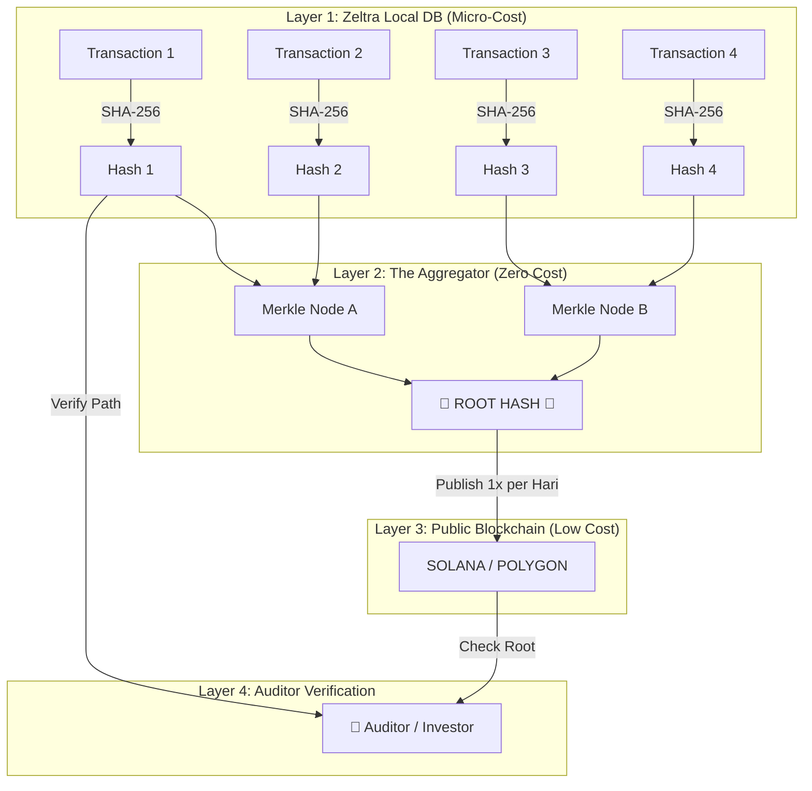

# Sentinel Architecture: The "Digital Notary" Logic

Dokumen ini menjelaskan gimana cara kita bikin sistem "Anti-Tipu" yang murah tapi canggih (Merkle Tree Aggregation).

---

## 🏗️ The Flow (Flowchart)

Gimana data transaksi berubah jadi "Bukti Abadi" di Blockchain tanpa bikin bangkrut.

---

## 💡 Penjelasan Gampang (Analoginya)

Bayangkan kita punya **Gudang Dokumen (Zeltra)**.

1.  **Layer 1 (Sidik Jari)**:
    Setiap ada kertas masuk (transaksi), kita gak cuma simpan kertasnya. Kita foto kertasnya, terus kita bikin "Sidik Jari Digital" (Hash). Kalau ada yang coret 1 huruf aja di kertas itu, sidik jarinya berubah total.

2.  **Layer 2 (Kardus & Segel - Merkle Tree)**:
    Daripada kita lapor ke notaris tiap 1 kertas (mahal), kita masukin 1.000 kertas ke dalam 1 Kardus Besar.
    Kita segel kardus itu pake **Satu Segel Utama (Root Hash)**.

    - Kalau ada 1 kertas di dalem yang diubah, Segel Utama di luar kardus bakal "pecah" otomatis (secara matematika).

3.  **Layer 3 (Notaris Publik - Blockchain)**:
    Kita cuma bawa **Foto Segel Utama** itu ke Notaris (Blockchain). Kita bayar biaya notaris cuma 1x sehari buat 1 foto segel itu. Murah kan?

    - Kita **GAK** kirim isi kertasnya (Data Transaksi tetap rahasia di gudang kita).
    - Kita cuma kirim "Bukti Segel"-nya.

4.  **Layer 4 (Auditor)**:
    Pas Auditor datang tahun depan, dia cuma tanya:
    _"Mana Segel Utama hari ini? Coba cocokin sama foto yang ada di Notaris."_
    - Kalau cocok = **Data Valid 100%**.
    - Kalau beda = **Ada yang nipu**.

## 💰 Cost Analysis

| Komponen           | Biaya        | Kenapa?                                                 |
| :----------------- | :----------- | :------------------------------------------------------ |
| **Hashing Engine** | Hampir $0    | Jalan di CPU server biasa (Rust cepet banget).          |
| **Merkle Tree**    | $0           | Cuma matematika di memory RAM.                          |
| **Blockchain Fee** | $0.05 / hari | Cuma kirim 1 string teks (Root Hash) ke Solana/Polygon. |
| **Storage**        | Murah        | Hash cuma teks pendek, gak makan harddisk.              |

**Kesimpulan:**
Kita dapet keamanan selevel **Bank Sentral** dengan harga **Kacang Goreng**.
